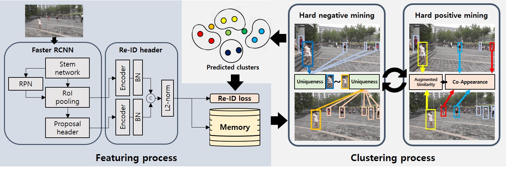

# Context-Aware Unsupervised Clustering for Person Search

Official pytorch implementation for BMVC 2021 [Context-Aware Unsupervised Clustering for Person Search]().

This code is based on Chen et al's code for [NAE4PS](https://github.com/DeanChan/NAE4PS).

<figure align="center">
  
  <figcaption>
    Overall architecture
  </figcaption>
</figure>

## Settings

1. Clone the repository

    ```bash
    git clone https://github.com/VIP-Lab-UNIST/CUCPS.git && cd CUCPS
    ```

2. Build environment with conda

    ```bash
    conda env create --prefix <your_conda_env_path> -f environment.yml
    ```

3.  Set the Datasets

    Download [CUHK-SYSU](https://github.com/ShuangLI59/person_search) and [PRW](https://github.com/liangzheng06/PRW-baseline) to your location and set the dataset path in `./lib/datasets/__init__.py`.

## Train
    
Set the save path(--path) in the .sh files.

1. Train CUHK-SYSU
    ```bash
   ./train-cuhk.sh
   ```

2. Train PRW
    ```bash
   ./train-prw.sh
   ```
   
## Test

Add the checkpoint that you want to evaluate on the `--checkpoint_name` option in test-*.sh files. 

* You can also evaluate pretrained weight of test 26, 18 epochs for [CUHK-SYSU](), [PRW](), respectively.

1. Test CUHK-SYSU
   
    ```bash
    ./test-cuhk.sh
    ```

2. Test PRW(regular gallery)

    ```bash
    ./test-prw.sh
    ```

3. Test PRW(multi-view gallery)
    
    Set `ignore_cam_id=False` and `remove_unlabel=False` of `search_performance_calc` function on `runs/test.py` 
    
    ```bash
    ./test-prw.sh
    ```

The result will be saved in same directory with checkpoint file.

## Results on the pretrained models

| Datasets                  |mAP(%)|Rank-1(%)|
| :-------------------------|:----:|:----:|
| CUHK-SYSU                 | 81.1 | 83.2 |
| PRW(regular gallery)      | 41.7 | 86.0 |
| PRW(multi-view gallery)   | 36.6 | 64.9 |

## Citation

```
@article{cucps,
  title={Context-Aware Unsupervised Clustering for Person Search},
  author={Byeong-Ju Han*, Kuhyeun Ko* and Jae-Young Sim},
  booktitle = {British Machine Vision Conference (BMVC)},
  year={2021},
}
```
